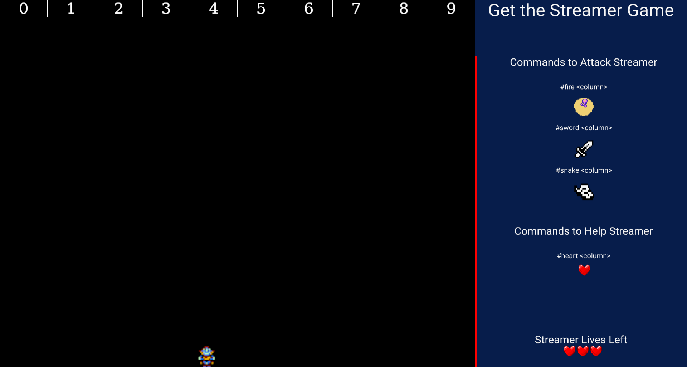
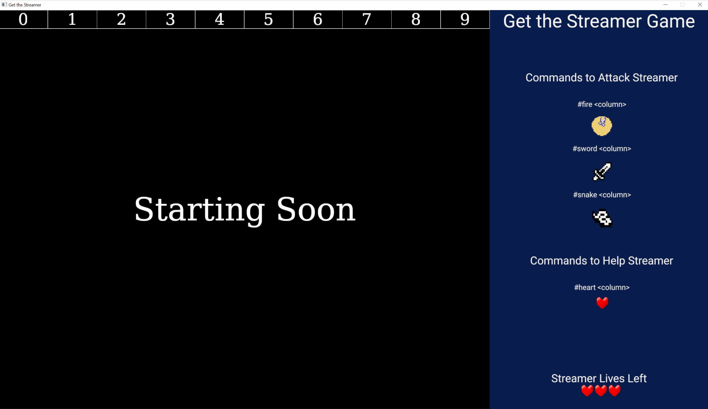

# Get the Streamer Game





## Introduction

The Get the Streamer game is a game meant to be played by streamers on Twitch.tv with/against their viewers. The game listens to chat, who can use commands to drop objects into the arena. The streamer takes the roll of the player and has a limited time to avoid all of the objects. If they do so without losing all of their lives then they win!

**Chatters receive points for participating**

- 1 point for dropping an object into the game.
- 10 points for successfully hitting the player.

**How to Drop as a viewer?**

In chat after the game has started, logged-in Twitch.tv viewers can run one of the drop commands displayed on the right-side of the game. The commands look like `#fire 5` where **fire** is the object that will be dropped and **5** is the column that the object will be dropped into. If the viewer doesn't know what column to drop into they can leave that off and the game will choose one randomly.

**What items can be dropped?**

Each of these objects will add or remove 1 heart when hitting the player.

- **fire** - The fire drops straight down, then stays on the ground for a few seconds before burning out.
- **sword** - The sword bounces to the right with a random velocity. After several bounces it will fall through the arena floor and dissapear.
- **snake** - The snake will fall straight down, then slither towards the player. It will continue until it goes off-screen.
- **heart** - The viewers can drop this straight down to help (or set up a trap for the player). If the player touches a heart they get one more life!

The player gets some i-frames when they are hit by an object (including the heart) which hopefully should give them a chance when there is a lot of viewers.

**How to move as the player?**

Move the player left and right with the **a** and **d** keys respectively. You can jump with **space**.

**Winning the game**

Vieweres win the game when the player runs out of hearts before the timer runs out. The player will win if they survive long enough for the timer to run out before they lose all of their hearts.

The game keeps track of points over all rounds played by saving scores to a standard location on your computer. During the credits after the game is done viewers can see how well they did this round, and what their new total is.

This file is stored at

**Windows**

`c:\{home directory}\AppData\Roaming\Brooks Builds\Get the Streamer\config\high_scores`

**Mac**

`$HOME/Library/Preferences/Brooks-Builds.Get-the-Streamer/high_scores`

**Linux**

`$HOME/.config/getthestreamer/high_scores`

## Setup for playing

Download the game from one of the following links.

- [Windows 10](https://get-the-streamer-game.s3-us-west-1.amazonaws.com/get_the_streamer_windows.zip)
- [Mac](https://get-the-streamer-game.s3-us-west-1.amazonaws.com/get_the_streamer_mac.zip)
- [Linux (Debian)](https://get-the-streamer-game.s3-us-west-1.amazonaws.com/get_the_streamer_linux.zip)

Unzip the game into any directory on your computer.

Copy the **env_example** file to **.env** and update the values

1. _TWITCH_NAME_ is the twitch user name (you will need a Twitch account)
1. _TWITCH_TOKEN_ is the oauth token, you can get one by visiting [https://twitchapps.com/tmi/](https://twitchapps.com/tmi/) and creating a new application. _Note, if you are streaming while setting this up, hide your screen during this step as your oauth token is essentially your password_
1. _TWITCH_CHANNEL_ is the Twitch channel name that you want the game to listen to

## Setup for contributing

### Install Rust

Install Rust Stable at [rust-lang.org](https://www.rust-lang.org/).

### Set up your .env file

1. Copy the [`env_example`](./env_example) to `.env`
1. _TWITCH_NAME_ is the twitch user name (you will need a Twitch account)
1. _TWITCH_TOKEN_ is the oauth token, you can get one by visiting [https://twitchapps.com/tmi/](https://twitchapps.com/tmi/) and creating a new application. _Note, if you are streaming while setting this up, hide your screen during this step as your oauth token is essentially your password_
1. _TWITCH_CHANNEL_ is the Twitch channel name that you want the game to listen to

As an alternate option run the command `./setupEnv.sh` from the terminal.

### Run the Game!

The following command will run the game and listen to Twitch chat.

```sh
cargo run
```

You can also run the game in test mode, which won't listen to Twitch chat, but instead will simulate a busy chat playing the game. This can be used to practice, but also test any features that you are working on.

```sh
cargo test
```

## Want to help? New ideas?

New ideas and feature requests are done within the [issues page](https://github.com/brooks-builds/get_the_streamer_game/issues).

If you want to add a feature please feel free to open a pull request.
